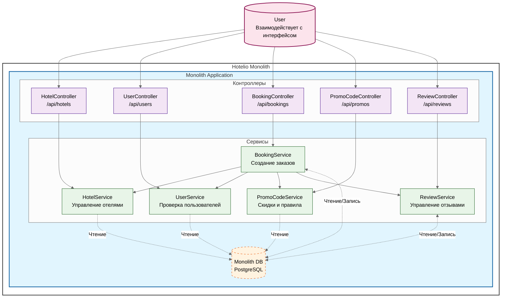
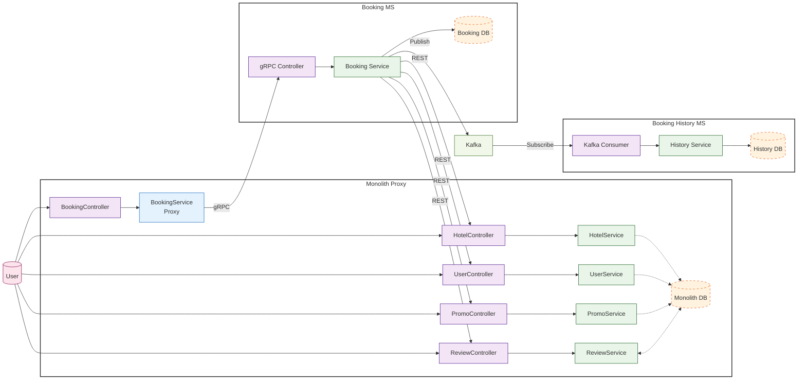

### **Название задачи:** Задание 1. Проработка миграции от монолита к микросервисам
### **Автор:** Гуреев Евгений
### **Дата:** январь 2026

### **Функциональные требования**

#### Краткое верхнеуровневые Use Cases с пошаговым описанием отдельных функций каждого модуля:

|**№**|**Действующие лица или системы**|**Use Case**|**Описание**|
| --- | -------------- | ----------------------------- | --------------------------------- |
| 1   | Пользователь   | Бронирование отеля            | 1. Запрос пользователя `POST /api/bookings` с `userId`, `hotelId`, `promoCode`. 2. Система валидирует (isUserActive/isUserBlacklisted в `UserService`, operational/booked в `HotelService`, validate/getDiscount в `PromoCodeService`, `isTrustedHotel` в ReviewService). 3. Рассчитывает basePrice, discount из `PromoCodeService`, finalPrice. 4. Сохраняет `Booking`. 5. Возвращает `Booking ID`. |
| 2   | Пользователь   | Поиск отелей                  | 1. Запрос пользователя `GET /api/hotels/by-city?city=Seoul`. 2. Система получает отели из `HotelService` с фильтрацией по city. 4. Возвращает список отелей. |
| 3   | Пользователь   | Проверка статуса пользователя | 1. Запрос пользователя `GET /api/users/{userId}/status`. 2. Система получает статус пользователя из `UserService`. 3. Возвращает `status`. |
| 4   | Пользователь   | Валидация промокода           | 1. Запрос пользователя `GET /api/promos/{code}/valid?isVipUser=true`. 2. Система получает из `PromoCodeService` получает описание действующих на текущею дату промо по `promo_code` и, опционально, для  `valid/expired/vip_only/discount`. 3. Возвращает `valid` (true/false). |
| 5   | Пользователь   | Проверка отзывов отеля        | 1. Запрос пользователя `GET /api/reviews/hotel/{hotelId}`. 2.  Система получает описание отеля из `ReviewService` по `hotelId`, возвращает список с `id`/`user_id`/`rating`/`created_at`. 3. Запрос надежности отеля `GET /api/reviews/hotel/{hotelId}/trusted` — rating >=4.0 и count >=10 (рейтинг более 4 и число заказов более 10). |

#### Требования текущего этапа

На текущем этапе новых функциональных требований к системе нет. Необходимо начать переход на микросервисную архитектуру без изменения текущего функционала.

### **Нефункциональные требования**

#### Общие не функциональные требования:

| №   | Требование    |
| --- | ----------------------------------------------------------------------------- |
| 1   | `Масштабируемость`: Возможность  масштабирования компонентов/микросервисов.   |
| 2   | `Отказоустойчивость`: Уровень доступности 99.9%, отмена вызовов методов при долгих ответах, обратный прокси в монолите, метрики и логи на каждый сервис. |
| 3   | `CI/CD`: Независимая разработка команд, быстрый вывод версий, тесты. |
| 4   | `Производительность`: задержка <2 с для уровня, асинхронные события (Kafka) для проверки <5 с, GraphQL BFF для фронта (один запрос). |
| 5   | `Безопасность`: безопасность API (JWT), согласованность данных (исходящие для Kafka, SAGA). |

#### Требования текущего этапа

| №   | Требование    |
| --- | ----------------------------------------------------------------------------- |
| 1   | Проанализировать текущее состояние системы и предложить план перехода на микросервисную архитектуру.   |
| 2   | Выбрать один модуль в текущей системе, который будет первым выноситься в микросервис. |

### **Решение**

#### Контекст

Сервис Hotelio реализован как единое приложение, в котором все бизнес-функции собраны в одном коде, разворачиваются как единый сервис и используют одну базу данных.

С ростом бизнеса возникли серьёзные архитектурные и операционные проблемы. Команда приняла решение о переходе на микросервисную архитектуру с постепенным выносом сервисов.

Общение между сервисом и остальной системой было решено реализовать через gRPC.  
Логику для остальных сервисов переносить не нужно: данные в микросервисе должны получаться через REST.
Сервис booking-service отправляет событие в Kafka (BookingCreated).  
Сервис booking-history-service слушает события и формирует статистику асинхронно, без нагрузки на боевую БД.

##### Цели бизнеса:
Начать поэтапный переход к микросервисной архитектуре, применяя паттерн Strangler Fig, — выносить по одному компоненту, оставляя остальной функционал в монолите.
Подготовить архитектурный анализ и план начала миграции на микросервисы.

PlantUML: 
[исходная_схема.puml](diagram/исходная_схема.puml)

Mermaid:

#### Целевая архитектура

В целевой архитектуре каждый модуль в текущей архитектуре должен быть вынесен в отдельный микросервис со своей БД.

На начальном этапе будет выноситься BookingService, так как это критичный модуль с высокой нагрузкой (пики бронирований). Также у него множество зависимостей (UserService, HotelService, PromoCodeService, ReviewService).

PlantUML: 
[целевая_схема.puml](diagram/целевая_схема.puml)

Mermaid:

### **План миграции**: 
1. Proxy в монолите с gRPC к первому микросервису BookingService.
2. Новый Booking микросервис с отдельной базой данных (PostgreSQL)
3. Асинхронная история в сервис BookingHistoryService
4. Взаимодействие BookingService с монолитом по REST.
3. Тестирование.
4. Развертывание.

### **Альтернативы**

Самым простым является PromoCodeService. Он меньше влияет на бизнес и может быть выбран для переноса в микросервис. Он больше подходит для команды не имеющей опыта миграции монолита на микросервисы.

**Недостатки, ограничения, риски**

Среди модулей наиболее ценным для бизнеса является модуль BookingService. В то же время он является наиболее нагруженным. Вынесение этого модуля позволит снизить нагрузку с БД монолита и воспользоваться преимуществами масштабирования микросервиса, но до завершения первого этапа не снимет полностью нагрузку с монолита и потребует синхронизации БД.  
Идеальный вариант для бизнеса, так как быстрее позволит выполнить масштабирование микросервиса, а также позволит команде получить опыт миграции на примете сложного сервиса и обозначит схему взаимосвязи сервисов.

Начало миграции с PromoCodeService позволит команде получить опыт миграции на примете простого сервиса и быстрее вынести из монолита один сервис, а последующая миграция других простых сервисов подготовим почву для взаимодействия сложных сервисов с уже уже вынесенными сервисами.  
Несёт риски для бизнеса так как затягивает масштабирования для повышения отказоустойчивости системы.
